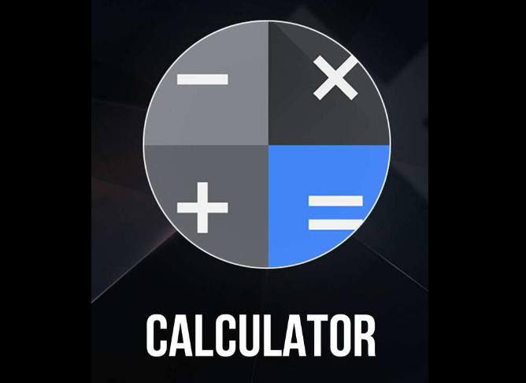

# 🧮 Simple Web Calculator

This is a simple, responsive web-based calculator built using HTML, CSS, and JavaScript. The calculator can handle basic arithmetic operations such as addition, subtraction, multiplication, division, and percentage calculations. The design features a modern UI with a gradient background and interactive buttons.

## 🌟 Features

- **Basic Arithmetic Operations**: Supports addition, subtraction, multiplication, division, and percentage calculations.
- **Responsive Design**: The calculator is fully responsive, with a modern, sleek interface.
- **Clear and Delete Functions**: Includes "AC" (All Clear) and "DEL" (Delete) buttons for resetting or correcting input.
- **Real-time Calculation**: Displays the calculation result in real-time when the "=" button is pressed.

## 📂 Project Structure

- `index.html`: The main HTML file that defines the structure of the calculator.
- `calculator.css`: The CSS file that provides styling, including the layout, colors, and responsive design.
- `calculator.js`: The JavaScript file that adds functionality, enabling the calculator to perform arithmetic operations.

## 🚀 Getting Started

To run the calculator locally:

1. **Clone the repository**:
   ```bash
   git clone https://github.com/your-username/simple-web-calculator.git
   cd simple-web-calculator
   ```

2. **Open the project**:
   Open `index.html` in your preferred web browser.

3. **Interact with the calculator**:
   - Use the number buttons to input values.
   - Use the arithmetic operator buttons (`+`, `-`, `*`, `/`, `%`) to choose an operation.
   - Press the "=" button to see the result.
   - Use "AC" to clear all inputs, or "DEL" to delete the last digit.

## 🖼️ Screenshot



## 📜 License

This project is licensed under the MIT License. See the [LICENSE](LICENSE) file for details.
i will write that later
## 🙌 Acknowledgments

- Inspired by the need for a simple, yet elegant, web-based calculator.
- Thanks to the creators of the Poppins font and other resources used in this project.

---

!
